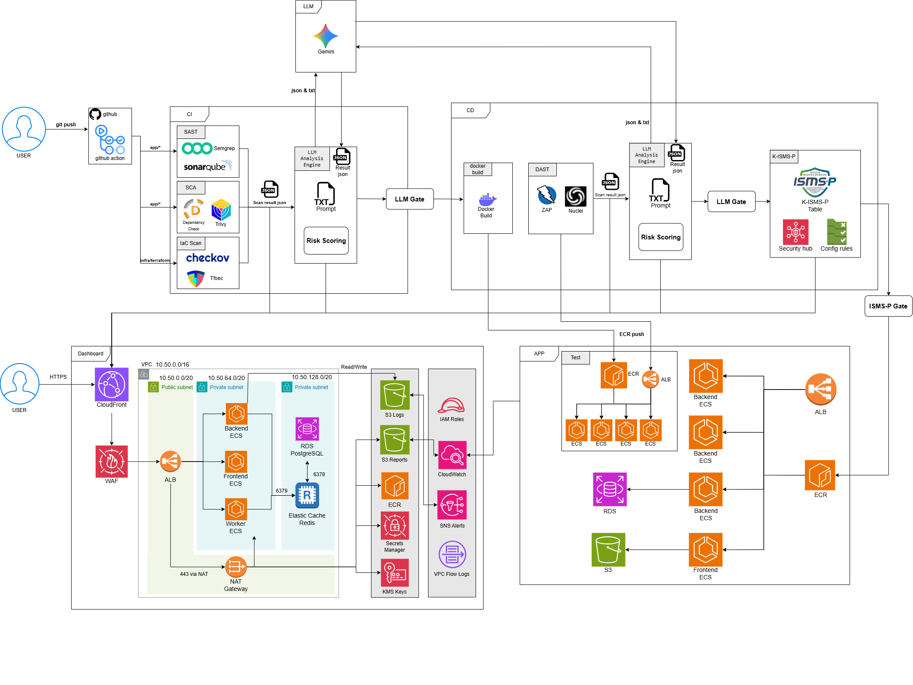

# SecureFlow

SecureFlow는 다음 요소를 한 저장소에서 함께 관리하는 DevSecOps 플랫폼입니다.

- 보안 분석 플랫폼 (`backend`, `engine`, `frontend`, `ismsp`)
- 배포 대상 샘플 애플리케이션 (`app/*`)
- CI/CD 및 보안 게이트를 수행하는 GitHub Actions 워크플로
- 대시보드 및 런타임 환경을 위한 AWS 인프라 코드

현재 파이프라인은 보안 영역별로 2개 도구를 병행 실행하고, 그 결과를 LLM 게이트로 교차검증한 뒤, raw 결과와 gate 결과를 백엔드로 업로드해 대시보드와 리포트에 반영하는 구조를 사용합니다.

## 저장소 구성

이 저장소는 크게 두 축으로 나뉩니다.

### 1. SecureFlow 플랫폼

- `backend/`: FastAPI API, DB 모델, 리포트/조회 엔드포인트, Celery 연동
- `engine/`: 파싱, 정규화, 매칭, 점수 계산, 리포트 유틸리티
- `frontend/`: SecureFlow 대시보드 UI
- `ismsp/`: ISMS-P 게이트 및 리포트 보조 로직
- `secureflow_dashboard_infra/`: AWS 인프라용 Terraform 코드

### 2. 배포 대상 애플리케이션

- `app/api-server-fastapi/`: FastAPI 샘플 API
- `app/api-server-node/`: Express 샘플 API
- `app/api-server-spring/`: Spring Boot 샘플 API
- `app/frontend/`: React 샘플 프론트엔드

이 대상 애플리케이션들이 CI/CD에서 실제로 스캔, 게이트 판정, 배포 대상으로 사용됩니다.

## 아키텍처

전체 흐름은 아래처럼 이해하면 됩니다.

1. GitHub Actions가 대상 앱과 인프라 코드에 대해 CI 보안 검사를 수행합니다.
2. 각 보안 영역은 가능한 경우 2개 도구를 함께 사용합니다.
3. LLM gate 스크립트가 두 도구 결과를 바탕으로 교차검증 판정을 생성합니다.
4. raw 스캔 결과와 gate 결과를 SecureFlow 백엔드로 업로드합니다.
5. 백엔드는 결과를 저장하고 대시보드용 리포트를 생성합니다.
6. CD는 먼저 staging에 배포한 뒤 image scan, DAST, ISMS-P 검사를 수행하고, production ECS 배포는 `main` 브랜치에서만 허용합니다.



## 기술 스택

### 플랫폼

| 영역 | 스택 |
| --- | --- |
| Backend API | FastAPI, SQLAlchemy, Pydantic, Alembic |
| 비동기/워커 | Celery, Redis |
| 데이터베이스 | PostgreSQL, SQLite (로컬/개발용 흔적 포함) |
| 대시보드 프론트엔드 | React 19, TypeScript, Vite 7, Tailwind CSS 4, Radix UI, Recharts |
| 분석/리포팅 | Python, 커스텀 engine 모듈, ReportLab |
| LLM 연동 | Google GenAI / Gemini 기반 스크립트와 게이트 |
| 컴플라이언스 | boto3 기반 ISMS-P 점검 |

### 보안 도구

| 영역 | 도구 |
| --- | --- |
| SAST | Semgrep, SonarQube |
| SCA | Trivy, OWASP Dependency-Check |
| IaC | Checkov, tfsec |
| Image | Trivy, Grype |
| DAST | ZAP, Nuclei |
| Gate 계층 | `scripts/ci/` 아래 LLM gate 스크립트 |

### 배포 대상 앱 스택

| 앱 | 스택 |
| --- | --- |
| `app/api-server-fastapi` | FastAPI, Uvicorn |
| `app/api-server-node` | Express, AWS SDK v3, MySQL / Redis 관련 패키지 |
| `app/api-server-spring` | Spring Boot 3.2, Java 17, Redis, JDBC |
| `app/frontend` | React, Vite |

### 인프라 및 배포

| 영역 | 스택 |
| --- | --- |
| CI/CD | GitHub Actions |
| 컨테이너 | Docker, Docker Compose |
| AWS 인프라 | Terraform |
| 런타임 서비스 | ECS, ECR, ALB, CloudFront, WAF, RDS, Redis, S3, CloudWatch, Secrets Manager |

## 저장소 맵

```text
secureflow/
+-- .github/workflows/           CI/CD 및 보안 워크플로
+-- app/                         배포 대상 애플리케이션
|   +-- api-server-fastapi/
|   +-- api-server-node/
|   +-- api-server-spring/
|   '-- frontend/
+-- backend/                     SecureFlow FastAPI 백엔드
+-- engine/                      파싱, 매칭, 점수 계산, 리포팅 로직
+-- frontend/                    SecureFlow 대시보드 프론트엔드
+-- ismsp/                       ISMS-P 점검 로직
+-- docs/                        아키텍처 및 사용 가이드
+-- infra/                       Docker / worker 관련 인프라 파일
'-- secureflow_dashboard_infra/  AWS 배포용 Terraform
```

## 현재 CI/CD 흐름

### CI

- 샘플 FastAPI, Node, Spring, frontend 대상 앱에 대한 기본 검증을 수행합니다.
- IaC, SAST, SCA 영역은 2개 도구씩 병행 실행합니다.
- LLM gate 결과를 생성해 백엔드에 업로드합니다.
- raw 스캔 결과를 백엔드에 업로드합니다.
- 현재 백엔드 구조와 호환되도록 Phase 1 대시보드 분석을 호출합니다.

### CD

- reusable ECS deploy 워크플로를 통해 staging ECS 배포를 수행합니다.
- staging에 올라간 이미지 기준으로 image scan을 수행합니다.
- 대표 URL을 대상으로 DAST를 수행합니다.
- image / DAST 게이트 이후 ISMS-P pre-production gate를 수행합니다.
- 현재 백엔드 구조와 호환되도록 Phase 2 대시보드 분석을 호출합니다.

### Production 배포 정책

- `SEO`, `sun` 같은 non-`main` 브랜치는 CI, staging 보안 검사, 업로드, 대시보드 반영까지만 수행합니다.
- 실제 production ECS 배포는 `main` 브랜치에서만 허용됩니다.

## 업로드 / API 메모

- 워크플로 업로드는 `API_SERVER_URL`을 사용합니다.
- WAF 우회 업로드는 `X-SecureFlow-Upload-Key` 헤더를 사용합니다.
- GitHub Secrets의 `SECUREFLOW_UPLOAD_KEY` 값은 인프라 쪽 bypass key와 동일해야 합니다.
- DAST 대표 URL은 EC2 퍼블릭 IP나 내부 포트(`:8000`)가 아니라 CloudFront 또는 ALB URL을 쓰는 것을 권장합니다.

## 로컬 개발

### 사전 준비

- Docker / Docker Compose
- 로컬 스크립트 실행용 Python 3.11+
- 프론트나 샘플 앱을 직접 실행하려면 Node.js 20+
- 백엔드 런타임 설정이 들어 있는 `.env`

### Docker Compose로 실행

```bash
docker compose up --build -d
```

또는 Makefile 사용:

```bash
make up
```

### 로컬 접근 주소

- Dashboard frontend: `http://localhost:3000`
- Backend API docs: `http://localhost:8000/docs`
- Backend API base: `http://localhost:8000/api/v1`
- SonarQube: `http://localhost:9000`

### 자주 쓰는 명령어

```bash
make logs
make test
make migrate
make seed
docker compose down
```

## 참고 문서

- [Architecture index](docs/architecture/README.md)
- [Local setup guide](docs/guides/local-setup.md)
- [Deployment guide](docs/guides/deployment.md)
- [Tool setup guide](docs/guides/tool-setup.md)
- [API docs index](docs/api/README.md)

## 참고 메모

- 루트 `frontend/`는 SecureFlow 대시보드입니다.
- `app/frontend/`는 별도의 샘플 프론트엔드 배포 대상입니다.
- 루트 `backend/`는 SecureFlow 백엔드이며, 샘플 FastAPI 앱과는 별개입니다.
- 현재 워크플로는 백엔드 업로드, 대시보드 반영, `main` 전용 production ECS 배포 정책을 기준으로 정리되어 있습니다.
