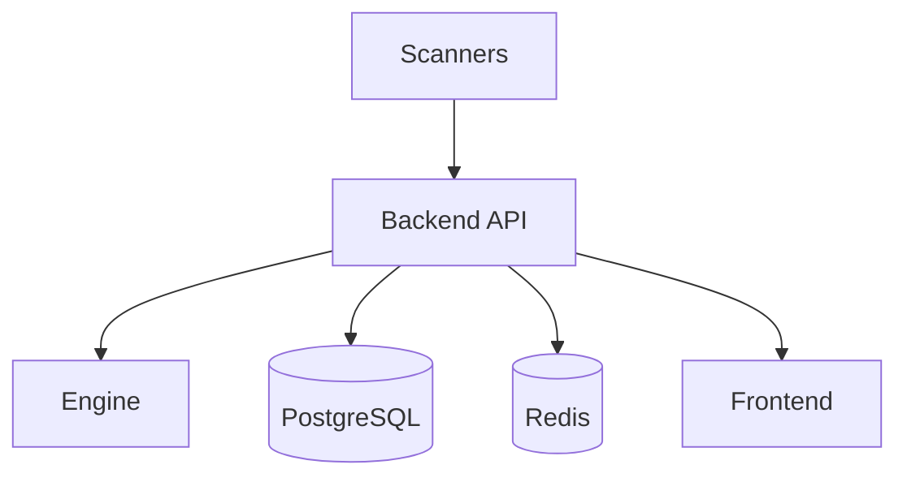

# Architecture

## Guides

- [AWS Zero To FastAPI](aws-zero-to-fastapi.md)
- [AWS Terraform Flow](aws-terraform-flow.md)
- [Target App And DevSecOps Architecture](target-app-devsecops-architecture.md)
- [Frontend One API Three Rollout](frontend-one-api-three-rollout.md)
- [Feature Based Routing](feature-based-routing.md)
- [LLM Risk Gate Pipeline](llm-risk-gate-pipeline.md)
- [GitHub Actions ECS CD Setup](github-actions-fastapi.md)
