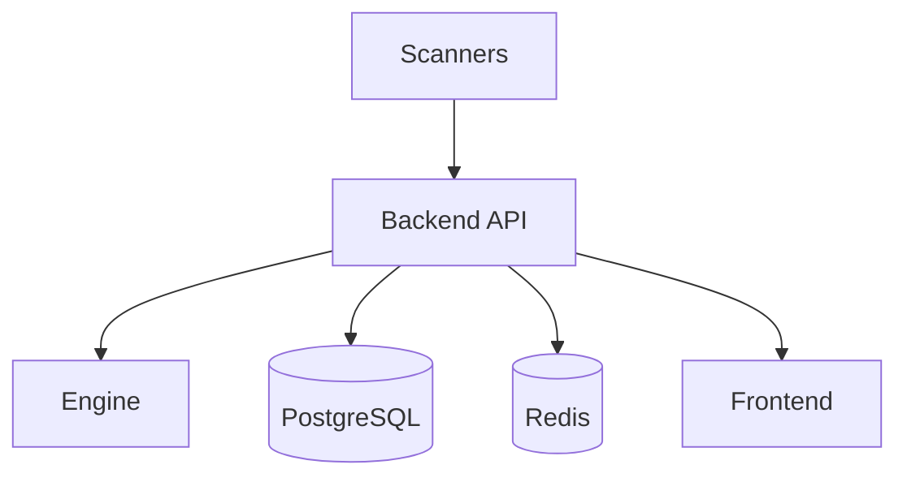

# Architecture

```mermaid
graph TD
  A[Scanners] --> B[Backend API]
  B --> C[Engine]
  B --> D[(PostgreSQL)]
  B --> E[(Redis)]
  B --> F[Frontend]
```

## Guides

- [AWS Terraform Flow](aws-terraform-flow.md)
- [FastAPI GitHub Actions Setup](github-actions-fastapi.md)
