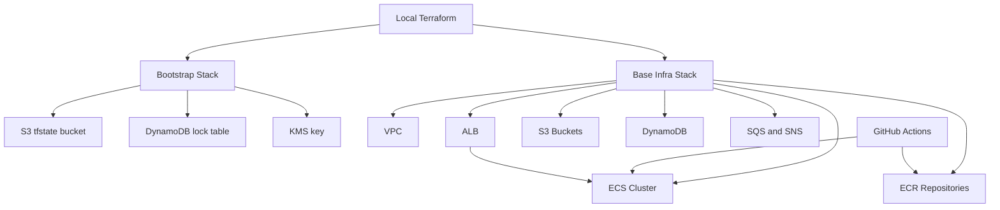

# AWS Terraform Flow

이 문서는 SecureFlow의 AWS 배포 흐름을 아주 짧게 요약한 다이어그램 문서입니다.

자세한 순서는 아래 문서를 참고하세요.

- [AWS Zero To FastAPI](aws-zero-to-fastapi.md)
- [FastAPI GitHub Actions Setup](github-actions-fastapi.md)
