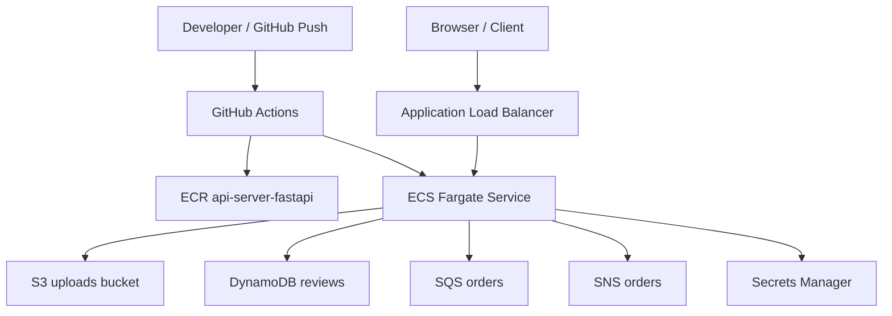

# AWS Zero To FastAPI

AWS에 아무것도 없는 상태에서 시작해서, 현재 `FastAPI` 서비스가 `ECS Fargate`에서 동작하고 `GitHub Actions CD`까지 연결된 상태를 정리한 문서입니다.

## 시작 상태

시작 시점의 전제는 아래와 같았습니다.

- AWS 계정에 애플리케이션 인프라가 전혀 없음
- 저장소에는 `app` 폴더 아래 서비스들만 존재
- 우선 `FastAPI` 1개를 먼저 올려서 배포 경로를 검증하기로 결정
- 인프라 관리는 `Terraform`으로 통일

## 목표

처음 목표는 아래 4가지를 만드는 것이었습니다.

1. Terraform을 안정적으로 적용할 수 있는 AWS 기본 바닥
2. 애플리케이션용 dev 인프라
3. FastAPI 서비스 1개 실제 배포
4. GitHub Actions를 통한 자동 배포 시작점

## 진행 순서

### 1. 로컬 준비

먼저 아래 도구를 설치하고 AWS 인증을 연결했습니다.

- `Terraform`
- `AWS CLI`
- `Docker Desktop`

그다음 AWS 인증이 정상인지 `aws sts get-caller-identity`로 확인했습니다.

### 2. Terraform bootstrap

Terraform state를 안전하게 관리하기 위해 bootstrap 스택을 먼저 적용했습니다.

생성한 리소스:

- Terraform state 저장용 `S3 bucket`
- state lock용 `DynamoDB table`
- state 암호화용 `KMS key`

관련 경로:

- `infra/terraform/bootstrap/`

이 단계가 끝나면서 이후 root Terraform 스택을 remote backend로 사용할 수 있게 됐습니다.

### 3. dev base infra

다음으로 실제 dev 인프라의 바닥 리소스를 Terraform으로 생성했습니다.

생성한 주요 리소스:

- `VPC`
- `Public subnet x2`
- `Private app subnet x2`
- `Private data subnet x2`
- `NAT Gateway`
- `Application Load Balancer`
- `ECS Cluster`
- `ECR repositories`
- `S3 frontend bucket`
- `S3 uploads bucket`
- `DynamoDB reviews table`
- `SQS queue`
- `SNS topic`
- `CloudWatch log groups`
- `IAM roles`
- 애플리케이션용 `KMS key`

당시 dev 기준 핵심 설정:

- `single_nat_gateway = true`
- `create_rds = false`
- `review_table_hash_key_type = "S"`

관련 경로:

- `infra/terraform/main.tf`
- `infra/terraform/variables.tf`
- `infra/terraform/outputs.tf`
- `infra/terraform/modules/*`
- `infra/terraform/environments/dev/terraform.tfvars`

### 4. FastAPI 우선 배포

3개의 API를 한 번에 올리지 않고, `FastAPI` 하나만 먼저 올리도록 결정했습니다.

이유:

- 현재 dev DynamoDB 키 타입이 `S`라서 FastAPI와 잘 맞음
- ECS, ALB, ECR, GitHub Actions 배포 흐름을 작은 범위에서 먼저 검증할 수 있음

이 단계에서 추가한 것:

- FastAPI용 `Dockerfile`
- FastAPI용 `.dockerignore`
- 재사용 가능한 `ecs-service` Terraform 모듈
- FastAPI ECS service / task definition
- ALB listener rule
- FastAPI JWT secret in `Secrets Manager`

FastAPI 컨테이너는 현재 아래 성격으로 배포됩니다.

- 포트: `8000`
- health check: `/api/health`
- DB: `sqlite`
- 파일 저장: `S3 uploads bucket`
- 리뷰 저장: `DynamoDB`
- 큐: `SQS`
- 알림: `SNS`

관련 경로:

- `app/api-server-fastapi/Dockerfile`
- `app/api-server-fastapi/.dockerignore`
- `infra/terraform/modules/ecs-service/`
- `infra/terraform/main.tf`

### 5. 수동 배포 검증

처음 배포는 수동으로 검증했습니다.

진행한 작업:

1. FastAPI 이미지를 Docker로 빌드
2. ECR 로그인
3. ECR에 이미지 push
4. Terraform으로 ECS service 활성화
5. ALB health check 확인

검증 결과:

- `ECS service` 생성 성공
- task `Running`
- target group `Healthy`
- `http://<alb>/api/health` 응답 성공

### 6. GitHub Actions CI/CD 연결

그다음 수동 배포를 자동화하기 위해 GitHub Actions를 연결했습니다.

추가한 워크플로:

- `CI Security Scan`
- `CD Deploy`

CI에서 하는 일:

- FastAPI smoke test
- `bandit` SAST
- `pip-audit`
- Docker build 확인
- Terraform `fmt` / `validate`
- `checkov` IaC scan

CD에서 하는 일:

1. GitHub OIDC로 AWS Role Assume
2. FastAPI 이미지를 ECR에 push
3. 현재 ECS task definition 조회
4. 새 이미지로 task definition revision 생성
5. ECS service rolling deploy

관련 경로:

- `.github/workflows/ci-security-scan.yml`
- `.github/workflows/cd-deploy.yml`
- `docs/architecture/github-actions-fastapi.md`

### 7. GitHub OIDC 설정

GitHub Actions에서 장기 AWS Access Key를 쓰지 않도록 OIDC 방식으로 연결했습니다.

진행한 작업:

- Terraform으로 GitHub Actions role 생성
- GitHub repository variable `AWS_ROLE_TO_ASSUME` 설정

이제 `main` 브랜치 push 또는 workflow dispatch로 CD를 실행할 수 있습니다.

## 현재 구조

## 지금까지 확인된 것

현재 실제로 확인된 항목은 아래와 같습니다.

- bootstrap 적용 성공
- dev base infra 적용 성공
- FastAPI 이미지 build / push 성공
- FastAPI ECS service 생성 성공
- ALB health check 성공
- `/api/health` 응답 성공
- GitHub Actions `CD Deploy` 성공

## 지금 상태에서의 의미

현재는 다음 상태까지 왔습니다.

- AWS에 dev 애플리케이션 기본 인프라가 존재함
- FastAPI 서비스 1개가 ECS에서 동작함
- GitHub Actions를 통해 자동 배포 가능함

즉, `AWS 빈 계정 -> Terraform 기반 인프라 -> FastAPI 실서비스 배포 -> GitHub Actions 자동 배포`까지 한 사이클을 완료한 상태입니다.

## 아직 남아 있는 것

아직 하지 않은 항목도 명확합니다.

- `CloudTrail`
- `GuardDuty`
- `Security Hub`
- `Inspector`
- `AWS Config`
- frontend 배포 자동화
- Node / Spring 서비스 추가 배포
- RDS 전환
- prod 환경 확장

## 현재 제한사항

지금 구조에서 알아두면 좋은 점:

- FastAPI는 현재 `sqlite` 기반이라 컨테이너 재생성 시 로컬 DB 데이터는 지속되지 않을 수 있음
- Node / Spring을 나중에 같이 붙이려면 경로나 도메인을 분리해야 함
- 현재 CD는 dev FastAPI 기준으로 고정된 리소스 이름을 사용함

## 다음 추천 단계

가장 자연스러운 다음 단계는 아래 중 하나입니다.

1. AWS 보안 baseline 추가
   - `CloudTrail`
   - `GuardDuty`
   - `Security Hub`
   - `Inspector`
   - `AWS Config`
2. FastAPI를 `RDS` 기반으로 전환
3. frontend 배포 자동화
4. 다른 API 서비스 확장 배포

## 관련 문서

- `infra/terraform/README.md`
- `docs/architecture/github-actions-fastapi.md`
