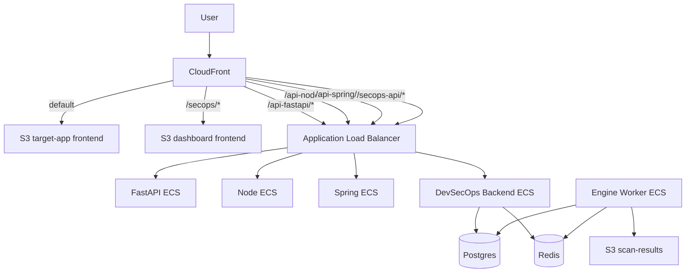

# Frontend One API Three Rollout

이 문서는 `frontend 1개 + API 3개 + dashboard 별도` 구조를 실제 AWS에 어떻게 배치할지 정리한 실행용 문서입니다.

## 결론부터

추천 구조는 아래입니다.

- 대상 앱 프론트: `app/frontend`
- 대상 앱 API:
  - `app/api-server-fastapi`
  - `app/api-server-node`
  - `app/api-server-spring`
- DevSecOps 대시보드 프론트: `frontend`
- DevSecOps 백엔드/엔진:
  - `backend`
  - `engine`

## 가장 중요한 제약

`ALB`는 요청 경로를 다른 경로로 바꿔주지 않습니다.

즉, 아래처럼 바로 라우팅만 하면:

- `/api-fastapi/*` -> FastAPI
- `/api-node/*` -> Node
- `/api-spring/*` -> Spring

백엔드 앱도 그 경로를 실제로 받아야 합니다.

그래서 dev 기준 추천 방법은 아래 두 가지 중 하나입니다.

### 방법 A. 앱들이 prefix 경로를 직접 받도록 수정

예시:

- FastAPI가 `/api-fastapi/*` 처리
- Node가 `/api-node/*` 처리
- Spring이 `/api-spring/*` 처리

장점:

- 추가 프록시 서비스가 필요 없음
- 현재 AWS 비용을 덜 늘림

단점:

- 각 API 앱에 prefix 대응 코드가 조금 필요

### 방법 B. 별도 API gateway/reverse proxy 추가

예시:

- ALB는 `/api-fastapi/*`, `/api-node/*`, `/api-spring/*` 모두 gateway로 보냄
- gateway가 prefix를 제거한 뒤 실제 API 서비스로 프록시

장점:

- 기존 API 코드 수정이 적음

단점:

- ECS 서비스가 하나 더 생김
- 운영 포인트가 늘어남

## 지금 추천

지금 단계에서는 **방법 A**가 더 좋습니다.

이유:

- 이미 서비스 수가 많아서 gateway까지 넣으면 복잡도가 급격히 증가함
- 학습/구축 단계에서는 앱 prefix 대응이 더 단순함

## 추천 URL 구조

### 대상 앱

- frontend: `/`
- FastAPI: `/api-fastapi/*`
- Node: `/api-node/*`
- Spring: `/api-spring/*`

### DevSecOps 플랫폼

- dashboard frontend: `/secops/*` 또는 별도 CloudFront
- dashboard backend: `/secops-api/*`

## AWS 배치 구조



## 서비스별 역할

### 대상 앱 프론트

`app/frontend`

역할:

- 사용자가 직접 보는 쇼핑 앱 UI
- 기능별로 서로 다른 API 호출

예시 분담:

- 인증 / 상품 조회: Node
- 리뷰 / 파일 업로드: FastAPI
- 주문 / 결제 흐름: Spring

### FastAPI

`app/api-server-fastapi`

추천 담당:

- 리뷰
- 업로드
- AI/비동기 보조 기능

### Node

`app/api-server-node`

추천 담당:

- 인증
- 상품 목록/상세
- 일반 CRUD

### Spring

`app/api-server-spring`

추천 담당:

- 주문
- 장바구니
- 트랜잭션성 로직

### DevSecOps 플랫폼

- `frontend`: 대시보드 UI
- `backend`: 결과 조회/리포트 API
- `engine`: 정규화/매칭/LLM 분석 worker

## 프론트 1개를 어떻게 API 3개에 연결할까

프론트는 `api.js`를 하나만 두는 대신, API별 base path를 분리하는 편이 좋습니다.

예시 env:

```env
VITE_FASTAPI_API_BASE=/api-fastapi
VITE_NODE_API_BASE=/api-node
VITE_SPRING_API_BASE=/api-spring
```

예시 개념:

- `nodeApi` client
- `fastapiApi` client
- `springApi` client

그리고 기능별로 호출 대상을 나눕니다.

## Terraform 작업 순서

### 1. frontend hosting 결정

추천:

- `app/frontend` -> `S3 + CloudFront`
- `frontend` -> `S3 + CloudFront` 또는 별도 distribution

이유:

- 둘 다 정적 프론트라 ECS보다 단순함
- 이미 Terraform에 frontend bucket 기반이 있음

### 2. Node API 서비스 추가

해야 할 일:

- `app/api-server-node` Dockerfile
- `.dockerignore`
- ECS task definition
- ECS service
- CloudWatch log group
- listener rule `/api-node/*`
- 필요한 env vars / secret 연결

### 3. Spring API 서비스 추가

해야 할 일:

- `app/api-server-spring` Dockerfile
- `.dockerignore`
- ECS task definition
- ECS service
- CloudWatch log group
- listener rule `/api-spring/*`
- 필요한 env vars / secret 연결

### 4. FastAPI 경로 prefix 반영

현재 FastAPI는 `/api/*`를 받습니다.

앞으로는 아래 둘 중 하나여야 합니다.

- `/api-fastapi/*`를 직접 받도록 앱 수정
- 또는 gateway 방식으로 전환

### 5. Node / Spring도 prefix 반영

Node:

- `/api-node/*`

Spring:

- `/api-spring/*`

### 6. app/frontend를 다중 API 호출 구조로 수정

현재는 단일 API base에 가깝습니다.

앞으로는 기능별로 API client를 나눠야 합니다.

### 7. dashboard 플랫폼 배포

그 다음에 아래를 배포합니다.

- `backend`
- `engine`
- `frontend`
- `Postgres`
- `Redis`
- `S3 scan-results`
- `SQS`

### 8. 보안 도구 연동

그 다음에서야 아래가 자연스럽습니다.

- `tfsec + Checkov`
- `Semgrep + SonarQube`
- `Trivy + Dependency-Check`
- `OWASP ZAP + another DAST`

## 실제 구현 우선순위

바로 다음 스프린트 기준 추천 순서:

1. `app/frontend` 배포
2. `api-server-node` 배포
3. `api-server-spring` 배포
4. API prefix 구조 반영
5. 프론트 API 분기 반영
6. 대상 앱 전체 배포 확인
7. DevSecOps 플랫폼 배포
8. LLM 보조 분석 파이프라인 연결

## LLM 위치

LLM은 여기서 사용합니다.

- 도구 결과 정규화 후
- 서로 충돌하거나 애매한 건만 분석
- 신뢰도 점수 보조
- 요약/설명 생성

LLM이 직접 `배포 승인/차단`을 최종 결정하지는 않습니다.

최종 결정은 반드시 규칙 엔진이 합니다.
