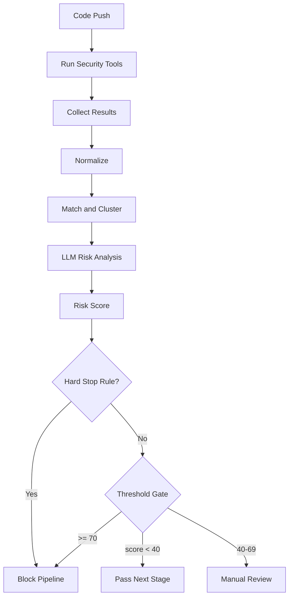

# LLM Risk Gate Pipeline

이 문서는 SecureFlow의 권장 DevSecOps 파이프라인에서 `LLM`을 어디에 두고, 어떤 방식으로 다음 단계 진행 여부를 결정할지 정리합니다.

## 목표

원하는 구조는 아래와 같습니다.

1. 여러 보안 도구가 결과를 생성
2. 결과를 정규화하고 묶음
3. `LLM`이 종합 분석
4. `리스크 스코어`를 계산
5. 점수가 임계치를 넘으면 파이프라인 중단
6. 점수가 임계치 아래면 다음 단계 진행

즉, LLM은 단순 요약기가 아니라 `중간 게이트 분석기` 역할을 수행합니다.

## 추천 구조

다만 권장 구현은 `LLM 단독 게이트`가 아니라 아래 구조입니다.

```text
도구 실행
-> 결과 수집
-> 정규화
-> 매칭 / 중복 제거
-> LLM 위험도 분석
-> risk score 산정
-> threshold gate
-> 다음 stage 진행 또는 중단
```

그리고 안전성을 위해 아래 한 줄을 반드시 추가합니다.

```text
명시적 치명 규칙은 LLM 점수와 별개로 hard-stop
```

## 왜 hard-stop이 필요한가

LLM만으로 통과/차단을 결정하면 아래 문제가 생길 수 있습니다.

- 같은 입력에도 점수가 흔들릴 수 있음
- 설명은 자연스럽지만 판정이 과하게 낙관적일 수 있음
- 치명적인 취약점을 낮게 평가할 가능성이 있음

그래서 아래처럼 나누는 것이 좋습니다.

- `Hard stop`: 명백한 치명 취약점, 비밀 유출, IaC 치명 misconfiguration
- `LLM risk gate`: 애매한 결과, 도구 간 충돌, 복합 위험도 평가

## 권장 판정 모델

### 1. 도구 카테고리

카테고리별 2개 도구 이상을 사용합니다.

- IaC: `tfsec` + `Checkov`
- SAST: `Semgrep` + `SonarQube`
- SCA: `Trivy` + `Dependency-Check`
- DAST: `OWASP ZAP` + another DAST tool

### 2. 정규화

도구별 출력 포맷을 공통 스키마로 바꿉니다.

예시 필드:

- category
- severity
- confidence
- file
- line
- cwe
- rule_id
- evidence
- tool_name

### 3. 매칭

같은 취약점으로 보이는 결과를 한 그룹으로 묶습니다.

예시:

- 동일 파일/라인
- 동일 엔드포인트
- 동일 CWE
- 동일 dependency CVE

### 4. LLM 분석 입력

LLM에는 raw 전체를 그대로 넣지 않고, `매칭된 그룹` 단위로 넣습니다.

예시 입력:

- 관련 코드 스니펫
- 도구 A 결과
- 도구 B 결과
- severity 차이
- confidence 차이
- 추가 컨텍스트

### 5. LLM 출력

LLM은 아래 구조처럼 리턴하는 편이 좋습니다.

```json
{
  "risk_score": 82,
  "verdict": "block",
  "reason": "Two tools detected the same issue and the code path is reachable from a public endpoint.",
  "confidence": "high",
  "recommended_action": "stop_pipeline",
  "manual_review": false
}
```

## 추천 threshold 예시

처음엔 너무 복잡하게 가지 말고 아래처럼 시작하는 것이 좋습니다.

- `0-39`: pass
- `40-69`: warning / manual review
- `70-100`: block

예시 규칙:

- `risk_score >= 70` 이면 다음 stage 중단
- `40 <= risk_score < 70` 이면 수동 검토 대기
- `risk_score < 40` 이면 다음 단계 진행

## hard-stop 예시

아래는 LLM 점수와 무관하게 바로 중단하는 항목 예시입니다.

- 공개 저장소에 비밀값 노출
- `0.0.0.0/0` + 민감 포트 개방 같은 치명 IaC 설정
- 원격 코드 실행 계열 critical
- 인증 우회
- 배포 이미지에서 known critical CVE 다수 검출

## 전체 파이프라인 그림



## SecureFlow에 맞춘 의미

SecureFlow에서는 LLM이 아래 역할을 맡게 됩니다.

- 여러 도구 결과를 종합해서 위험도 계산
- 서로 충돌하는 판단 정리
- 대시보드용 설명 생성
- 파이프라인 다음 단계 진행 여부 판단 보조

하지만 운영 안정성을 위해 최종 구조는 아래처럼 두는 것이 좋습니다.

- `LLM risk score`가 주된 gate
- `hard-stop rules`가 안전장치

즉, 지금 원하는 방향은 다음처럼 정리할 수 있습니다.

```text
LLM이 스코어링해서 진행 여부를 판단한다.
다만 명백한 치명 항목은 점수와 무관하게 즉시 중단한다.
```

## 지금 구조에서 다음 반영 포인트

이 설계를 현재 저장소에 반영하려면 다음이 필요합니다.

1. CI workflow를 `도구 결과 artifact 저장` 형태로 확장
2. backend / engine에서 결과 정규화 및 매칭 강화
3. LLM analyzer가 `risk_score`, `verdict`, `reason`을 반환하도록 통일
4. GitHub Actions 또는 backend worker가 threshold gate를 실제로 적용
5. dashboard에 `risk score`, `verdict`, `reason`, `hard-stop 여부` 표시
