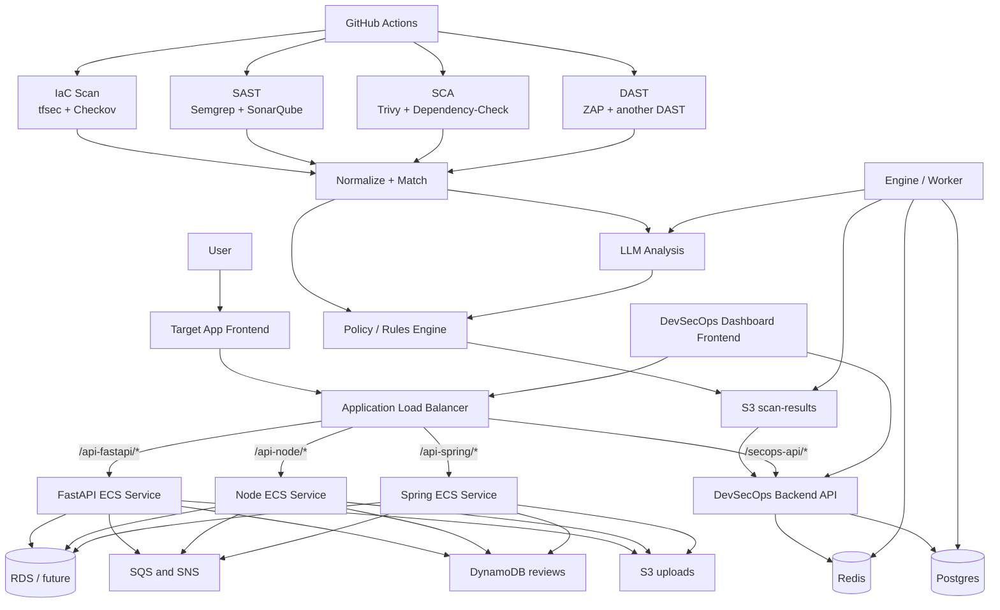

# Target App And DevSecOps Architecture

이 문서는 현재 SecureFlow를 아래 전제로 설계했을 때의 추천 구조를 정리합니다.

- 대상 앱 프론트는 `1개`
- 대상 앱 API 서버는 `3개`
- DevSecOps 플랫폼은 별도
- LLM은 `최종 승인자`가 아니라 `보조 분석기`

## 핵심 결정

### 1. 프론트는 1개로 간다

API 서버가 3개여도 프론트를 꼭 3개로 만들 필요는 없습니다.

추천 구조:

- 대상 앱 프론트: `app/frontend`
- API 서버:
  - `app/api-server-fastapi`
  - `app/api-server-node`
  - `app/api-server-spring`

프론트 1개가 기능별로 서로 다른 API를 호출하도록 구성합니다.

예시:

- 인증: Node
- 리뷰: FastAPI
- 주문: Spring

### 2. API는 path-based routing으로 분리한다

처음에는 서브도메인보다 경로 분리가 단순합니다.

추천 예시:

- frontend: `/`
- fastapi: `/api-fastapi/*`
- node: `/api-node/*`
- spring: `/api-spring/*`
- dashboard api: `/secops-api/*`

## 전체 구조

## 파이프라인에서 LLM 위치

LLM은 파이프라인 중간에 들어가도 되지만, 역할은 제한하는 것이 좋습니다.

추천 흐름:

1. 도구 2개씩 결과 생성
2. 정규화
3. 같은 취약점끼리 매칭
4. 규칙 기반 1차 판정
5. 애매하거나 충돌하는 결과만 LLM 분석
6. 최종 결과는 정책 엔진이 결정

즉:

- `pass / warning / block` 최종 결정은 규칙 엔진
- LLM은 `요약`, `충돌 해석`, `confidence 보조`, `manual review 추천`

## 왜 프론트 1개가 더 좋은가

- 사용자 입장에서 앱이 하나처럼 보임
- 데모와 발표에 더 자연스러움
- 배포와 운영이 단순함
- 스캔 대상 설명이 쉬움

프론트 3개는 "구현체 비교 데모"에는 좋지만, 지금 목적에는 운영 포인트가 너무 늘어납니다.

## 추천 기능 분담

처음에는 아래처럼 나누는 편이 현실적입니다.

- Node:
  - 인증
  - 상품 목록/상세
- FastAPI:
  - 리뷰
  - 업로드
- Spring:
  - 주문
  - 장바구니 일부 또는 비즈니스 로직

이렇게 하면 프론트 1개가 API를 기능별로 나눠 호출할 수 있습니다.

## AWS 배치 추천

### 대상 앱

- `app/frontend`
  - S3 + CloudFront 또는 ECS
- `api-server-fastapi`
  - ECS Fargate
- `api-server-node`
  - ECS Fargate
- `api-server-spring`
  - ECS Fargate

### DevSecOps 플랫폼

- `frontend`
  - 대시보드 프론트
- `backend`
  - DevSecOps API
- `engine`
  - 정규화/매칭/분석 worker
- 공용 데이터 계층
  - `Postgres`
  - `Redis`
  - `S3 scan-results`
  - `SQS`

## 구현 순서

추천 순서는 아래입니다.

1. 대상 앱 전체 배포
   - `app/frontend`
   - `api-server-node`
   - `api-server-spring`
   - 기존 `api-server-fastapi`
2. 프론트 1개가 API 3개를 경로별로 호출하도록 수정
3. DevSecOps 플랫폼 배포
   - `backend`
   - `engine`
   - `dashboard frontend`
4. 스캔 도구 2개씩 연결
5. 결과 정규화 / LLM 분석 / 대시보드 연결
6. 마지막에 CloudTrail / GuardDuty / Security Hub / Inspector / Config 추가

## 지금 기준 다음 액션

바로 다음 작업은 이것입니다.

1. `app/frontend`를 어떤 방식으로 배포할지 결정
2. `api-server-node` Dockerfile + ECS service 추가
3. `api-server-spring` Dockerfile + ECS service 추가
4. ALB path routing 설계 확정
5. 프론트 API 호출 경로를 `3개 API 분리형`으로 수정
